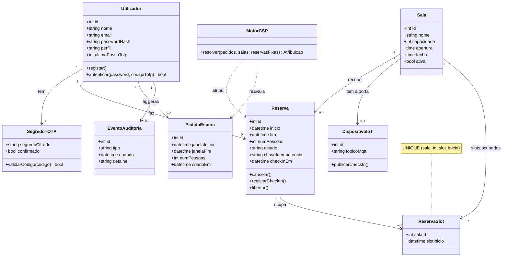
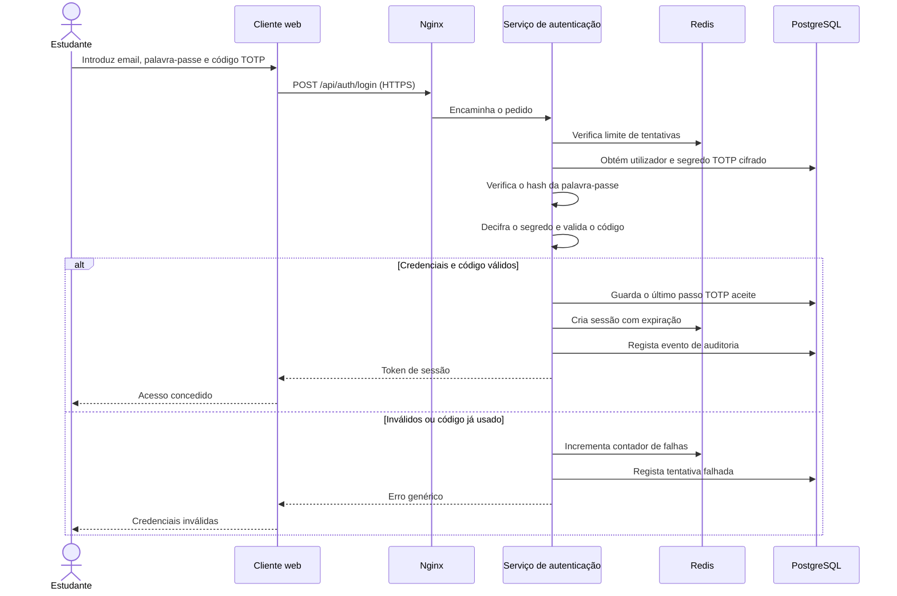
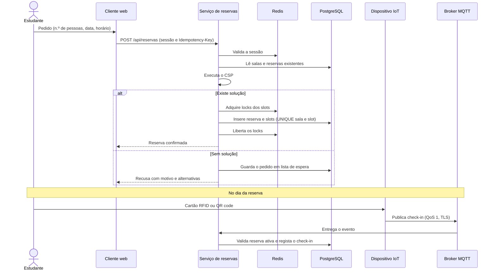
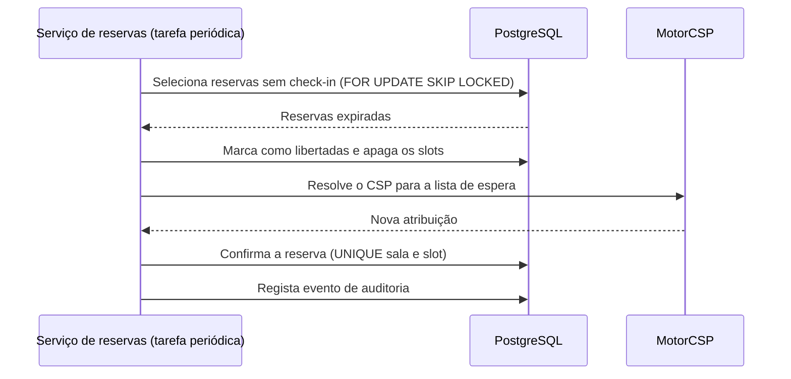

# Diagramas UML — StudySpot

## 1. Diagrama de classes

```mermaid
classDiagram
    class Utilizador {
        +int id
        +string nome
        +string email
        +string passwordHash
        +string perfil
        +int ultimoPassoTotp
        +registar()
        +autenticar(password, codigoTotp) bool
    }
    class SegredoTOTP {
        +string segredoCifrado
        +bool confirmado
        +validarCodigo(codigo) bool
    }
    class Sala {
        +int id
        +string nome
        +int capacidade
        +time abertura
        +time fecho
        +bool ativa
    }
    class Reserva {
        +int id
        +datetime inicio
        +datetime fim
        +int numPessoas
        +string estado
        +string chaveIdempotencia
        +datetime checkInEm
        +cancelar()
        +registarCheckIn()
        +libertar()
    }
    class ReservaSlot {
        +int salaId
        +datetime slotInicio
    }
    class PedidoEspera {
        +int id
        +datetime janelaInicio
        +datetime janelaFim
        +int numPessoas
        +datetime criadoEm
    }
    class DispositivoIoT {
        +int id
        +string topicoMqtt
        +publicarCheckIn()
    }
    class EventoAuditoria {
        +int id
        +string tipo
        +datetime quando
        +string detalhe
    }
    class MotorCSP {
        +resolver(pedidos, salas, reservasFixas) Atribuicao
    }

    Utilizador "1" --> "1" SegredoTOTP : tem
    Utilizador "1" --> "0..*" Reserva : faz
    Utilizador "1" --> "0..*" PedidoEspera : aguarda
    Utilizador "1" --> "0..*" EventoAuditoria : gera
    Sala "1" --> "0..*" Reserva : recebe
    Sala "1" --> "0..1" DispositivoIoT : tem à porta
    Reserva "1" --> "1..*" ReservaSlot : ocupa
    Sala "1" --> "0..*" ReservaSlot : slots ocupados
    MotorCSP ..> Reserva : atribui
    MotorCSP ..> PedidoEspera : reavalia
    note for ReservaSlot "UNIQUE (sala_id, slot_inicio)"
```

## 2. Sequência: login com 2FA

```mermaid
sequenceDiagram
    actor E as Estudante
    participant W as Cliente web
    participant N as Nginx
    participant A as Serviço de autenticação
    participant R as Redis
    participant DB as PostgreSQL

    E->>W: Introduz email, palavra-passe e código TOTP
    W->>N: POST /api/auth/login (HTTPS)
    N->>A: Encaminha o pedido
    A->>R: Verifica limite de tentativas
    A->>DB: Obtém utilizador e segredo TOTP cifrado
    A->>A: Verifica o hash da palavra-passe
    A->>A: Decifra o segredo e valida o código
    alt Credenciais e código válidos
        A->>DB: Guarda o último passo TOTP aceite
        A->>R: Cria sessão com expiração
        A->>DB: Regista evento de auditoria
        A-->>W: Token de sessão
        W-->>E: Acesso concedido
    else Inválidos ou código já usado
        A->>R: Incrementa contador de falhas
        A->>DB: Regista tentativa falhada
        A-->>W: Erro genérico
        W-->>E: Credenciais inválidas
    end
```

## 3. Sequência: pedido de reserva e check-in

```mermaid
sequenceDiagram
    actor E as Estudante
    participant W as Cliente web
    participant B as Serviço de reservas
    participant R as Redis
    participant DB as PostgreSQL
    participant D as Dispositivo IoT
    participant M as Broker MQTT

    E->>W: Pedido (n.º de pessoas, data, horário)
    W->>B: POST /api/reservas (sessão e Idempotency-Key)
    B->>R: Valida a sessão
    B->>DB: Lê salas e reservas existentes
    B->>B: Executa o CSP
    alt Existe solução
        B->>R: Adquire locks dos slots
        B->>DB: Insere reserva e slots (UNIQUE sala e slot)
        B->>R: Liberta os locks
        B-->>W: Reserva confirmada
    else Sem solução
        B->>DB: Guarda o pedido em lista de espera
        B-->>W: Recusa com motivo e alternativas
    end

    Note over E,M: No dia da reserva
    E->>D: Cartão RFID ou QR code
    D->>M: Publica check-in (QoS 1, TLS)
    M->>B: Entrega o evento
    B->>DB: Valida reserva ativa e regista o check-in
```

## 4. Sequência: libertação automática

```mermaid
sequenceDiagram
    participant T as Serviço de reservas (tarefa periódica)
    participant DB as PostgreSQL
    participant C as MotorCSP

    T->>DB: Seleciona reservas sem check-in (FOR UPDATE SKIP LOCKED)
    DB-->>T: Reservas expiradas
    T->>DB: Marca como libertadas e apaga os slots
    T->>C: Resolve o CSP para a lista de espera
    C-->>T: Nova atribuição
    T->>DB: Confirma a reserva (UNIQUE sala e slot)
    T->>DB: Regista evento de auditoria
```
